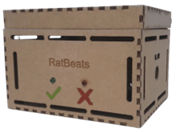
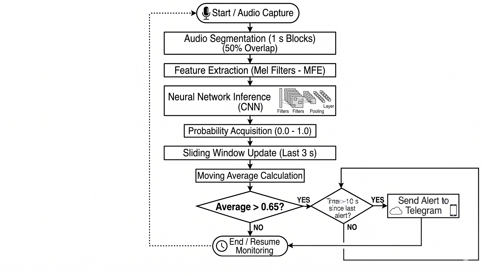

# RatBeats: Acoustic Rodent Detection System

RatBeats is a privacy-preserving, low-cost acoustic monitoring system powered by TinyML. It is designed to detect rodent activity in closed urban commercial environments directly on the edge. By utilizing a Seeed Studio XIAO ESP32-S3 and an INMP441 digital microphone, the system runs a quantized Convolutional Neural Network (CNN) to classify high-frequency rodent squeaks, filtering out background noise with a custom 3-second moving average algorithm.

When a threat is confirmed, RatBeats bypasses complex cloud intermediaries and sends a real-time alert directly to the user's smartphone via the Telegram API.

## Hardware Requirements

*   **Microcontroller:** Seeed Studio XIAO ESP32-S3
*   **Microphone:** INMP441 (I2S Omnidirectional Digital Microphone)
*   **Power Management:** TP4056 Module (USB-C)
*   **Battery:** 18650 Li-ion Battery (2500 mAh)
*   **Enclosure:** Custom laser-cut MDF box

## AI Model (Edge Impulse)

The acoustic classification model was trained using the [Edge Impulse](https://edgeimpulse.com/) platform. 
*   **Dataset:** Curated mix of simulated rodent vocalizations and diverse urban background noise (fans, packaging, impacts).
*   **Feature Extraction:** Mel Filterbank Energies (MFE) with 32 bands.
*   **Architecture:** 2D Convolutional Neural Network (CNN) quantized to INT8 precision.
*   **Footprint:** 12.8 KB RAM / 40.2 KB Flash / 1 ms inference latency.

## Repository Structure

*   `/dataset`: Contains the audio samples (`.wav`) used for training (rodent squeaks and background noise).
*   `/firmware`: The main Arduino sketch (`.ino`) deployed to the XIAO ESP32-S3.
*   `/model`: The exported Edge Impulse `.zip` library containing the trained CNN.
*   `/hardware`: Wiring schematics and MDF laser-cut files.

## Installation and Setup Guide

To compile and upload the firmware to your XIAO ESP32-S3, follow these exact steps using the Arduino IDE:

### 1. Arduino IDE Preparation
1. Download and install the [Arduino IDE](https://www.arduino.cc/en/software).
2. Open the IDE and go to **File > New Sketch**.
3. Go to the **Boards Manager** (the second icon on the left sidebar).
4. Search for `esp32` and install the package provided by **Espressif Systems**.

### 2. Board Configuration
1. Connect your XIAO ESP32-S3 to your computer via USB-C.
2. Go to the top menu: **Tools > Board > esp32** and select **XIAO_ESP32S3**.
3. Go to **Tools > Port** and select the active COM port corresponding to your board.
4. **CRITICAL STEP:** To ensure the AI model has enough memory to run, you must manually enable the external RAM. Go to **Tools > PSRAM** and select **OPI PSRAM**.

### 3. Importing the TinyML Model
1. Go to **Sketch > Include Library > Add .ZIP Library...**
2. Select the Edge Impulse model `.zip` file located in the `/model` folder of this repository.

### 4. Upload and Run
1. Open the RatBeats sketch from the `/firmware` folder.
2. Update the Wi-Fi credentials (`SSID` and `PASSWORD`) and your Telegram Bot Token in the code.
3. Click the **Upload** button (right arrow icon).
4. Once successfully uploaded, go to **Tools > Serial Monitor** (set the baud rate to 115200). You will see the initialization process, Wi-Fi connection status, and real-time inference probabilities.

If the 3-second moving average algorithm detects a rodent, you will immediately receive a notification on your configured Telegram chat.
